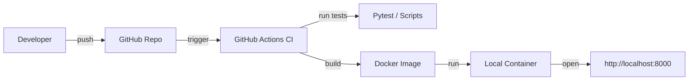

# Automation Scripts (DevSecOps Demo)

This repository demonstrates scripting and automation skills relevant to DevOps and security engineering.

## Technologies
- Python automation
- Bash scripting
- PowerShell scripting
- Unit testing (pytest)
- CI/CD (GitHub Actions)

## Purpose
Example scripts used in security operations:
- key rotation simulation
- system checks
- log collection

CI automatically runs tests on every push.

## What this demonstrates
- Scripting: PowerShell, Bash, Python
- Testing: pytest unit tests
- CI/CD: GitHub Actions pipeline (build/test/scans)
- DevSecOps: Bandit, ShellCheck, CodeQL (can be enabled)
- Next steps: Terraform, Docker, Kubernetes demos in separate repos

## Run locally (Docker)

This project is published as a Docker container via GitHub Container Registry.  
You do NOT need to install Python — only Docker.

⚠️ Make sure Docker Desktop is running before executing the commands.

### 1) Pull the image
```bash
docker pull ghcr.io/luanfeinie/automation-scripts:latest
```

### 2) Run the container

(Mac M-series users only)
```bash
docker run --platform linux/amd64 -p 8000:8000 ghcr.io/luanfeinie/automation-scripts:latest
```

### 3) Open in browser
[http://localhost:8000](http://localhost:8000)

## CI/CD

This project uses GitHub Actions to automatically test scripts on every push.
The pipeline validates that automation tasks run successfully before changes are merged.

## Architecture

This project simulates a small DevSecOps workflow:

- Developer pushes code
- GitHub Actions runs tests
- Docker image is built
- Container runs locally for validation



## Security

This repository follows basic security practices for a small DevSecOps demo project.

**What we scan**
- Python code: `bandit` static analysis
- Shell scripts: `shellcheck`
- Code scanning: GitHub CodeQL (optional)

**How to report a vulnerability**
If you find a security issue, please open a **private** issue or email: `***@example.com`. Do **not** post sensitive details in a public issue.

**Hardening notes**
- Secrets must never be checked in — use GitHub Secrets for CI/CD.
- CI runs tests and static analysis on every push.
- Docker images are built and pushed to GHCR for reproducible runs.

**Next steps**
- Add SCA (dependency scanning) and Dependabot for automated updates.
- Add a `SECURITY.md` file with responsible disclosure steps.

